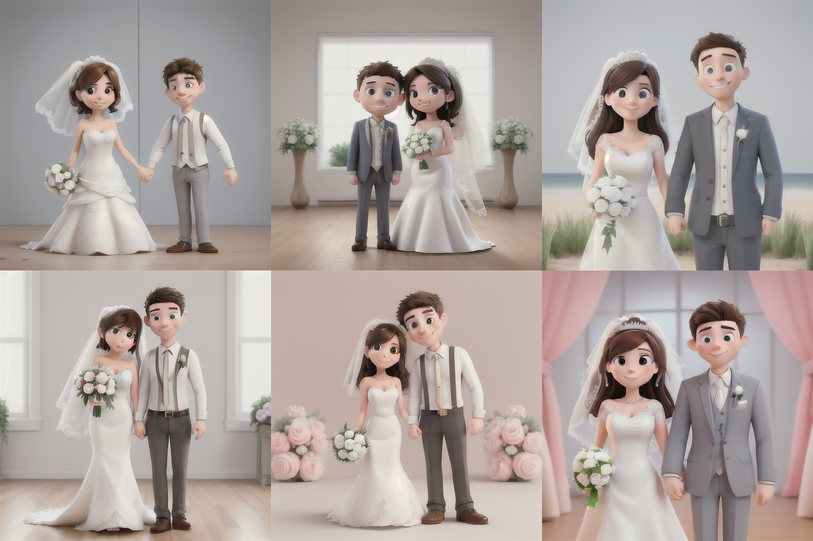

## Prompt

### Cases

#### D1

- **_CheckPoint_**: [anything-or](),
- **_Positive_**:wedding_dress,Two_people,Female+male,full_shot,
- **_Negative_**:bad anatomy,low quality,(fat:1.2),deformed,ugly,disfigured,
- **_Setting_**:Steps: 30, Sampler: DPM++ 2M Karras, CFG scale: 7, Seed: 124461280, Size: 512x512, Model hash: a1535d0a42, Model: anything-or, ControlNet 0: "Module: none, Model: control_v11p_sd15_openpose [cab727d4], Weight: 1, Resize Mode: Crop and Resize, Low Vram: False, Guidance Start: 0, Guidance End: 1, Pixel Perfect: False, Control Mode: Balanced, Hr Option: Both, Save Detected Map: True", Version: v1.8.0
- **_Output_**:

#### D1

- **_CheckPoint_**: [disney-pixar-cartoon-type-b](),
- **_Positive_**:Newlyweds,
- **_Negative_**:
- **_Setting_**:Steps: 30, Sampler: DPM++ 2M Karras, CFG scale: 7, Seed: 4055339766, Size: 512x512, Model hash: 732d0dd2cf, Model: disney-pixar-cartoon-type-b, Version: v1.8.0
- **_Output_**:

#### D1

- **_CheckPoint_**: [dreamshaper-xl](),
- **_Positive_**: white hair,
- **_Negative_**:
- **_Setting_**: Steps: 20, Sampler: DPM++ 2M Karras, CFG scale: 3, Seed: 854856599, Size: 1090x1090, Model hash: 4496b36d48, Model: dreamshaper-xl, ControlNet 0: "Module: instant_id_face_embedding, Model: ip-adapter_instant_id-sdxl [eb2d3ec0], Weight: 1, Resize Mode: Crop and Resize, Low Vram: False, Processor Res: 512, Guidance Start: 0, Guidance End: 1, Pixel Perfect: True, Control Mode: Balanced, Hr Option: Both, Save Detected Map: True", ControlNet 1: "Module: instant_id_face_keypoints, Model: control_instant_id-sdxl [c5c25a50], Weight: 1, Resize Mode: Crop and Resize, Low Vram: False, Processor Res: 512, Guidance Start: 0, Guidance End: 1, Pixel Perfect: True, Control Mode: Balanced, Hr Option: Both, Save Detected Map: True", Version: v1.8.0
- **_Output_**: 

#### D1

- **_CheckPoint_**: ,
- **_Positive_**:1girl,highres,
- **_Negative_**: blood on face,injury on face,long neck,bright,(monochrome:1.3),(oversaturated:1.3),bad hands,lowers,long body,((blurry)),duplicate,((duplicate body parts)),(disfigured),(poorly drawn),(extra limbs),fused fingers,extra fingers,(twisted),contorted,conjoined,((missing limbs)),logo,signature,text,words,low res,boring,mutated,artifacts,bad art,gross,ugly,poor quality,low quality,nsfw,(EasyNegative:1.2),ng_deepnegative_v1_75t,paintings,sketches,(worst quality:2),(low quality:2),(normal quality:2),lowres,normal quality,((monochrome)),((grayscale)),bad anatomy,(long hair:1.4),DeepNegative,(fat:1.2),facing away,looking away,tilted head,lowres,bad anatomy,bad hands,text,error,missing fingers,extra digit,fewer digits,cropped,worstquality,low quality,normal quality,jpegartifacts,signature,watermark,username,blurry,bad feet,cropped,poorly drawn hands,poorly drawn face,mutation,deformed,worst quality,low quality,normal quality,jpeg artifacts,signature,watermark,extra fingers,fewer digits,extra limbs,extra arms,extra legs,malformed limbs,fused fingers,too many fingers,long neck,cross-eyed,mutated hands,polar lowres,bad body,bad proportions,gross proportions,text,error,missing fingers,missing arms,missing legs,extra digi,nsfw,
- **_Setting_**:Steps: 20, Sampler: DPM++ 2M Karras, CFG scale: 1, Seed: 4279648834, Size: 944x1424, Model hash: be7b2c345e, Model: MR 3DQ \_SDXL V0.2, ControlNet 0: "Module: instant_id_face_embedding, Model: ip-adapter_instant_id-sdxl [eb2d3ec0], Weight: 0.8, Resize Mode: Crop and Resize, Low Vram: False, Processor Res: 512, Guidance Start: 0, Guidance End: 1, Pixel Perfect: False, Control Mode: Balanced, Hr Option: Both, Save Detected Map: True", ControlNet 1: "Module: instant_id_face_keypoints, Model: control_instant_id-sdxl [c5c25a50], Weight: 0.8, Resize Mode: Crop and Resize, Low Vram: False, Processor Res: 512, Guidance Start: 0, Guidance End: 1, Pixel Perfect: False, Control Mode: Balanced, Hr Option: Both, Save Detected Map: True", Version: v1.8.0
- **_Output_**:

#### D1

- **_CheckPoint_**: ,
- **_Positive_**:
- **_Negative_**:
- **_Setting_**:
- **_Output_**:

#### D1

- **_CheckPoint_**: ,
- **_Positive_**:
- **_Negative_**:
- **_Setting_**:
- **_Output_**:

#### D1

- **_CheckPoint_**: ,
- **_Positive_**:
- **_Negative_**:
- **_Setting_**:
- **_Output_**:

#### D1

- **_CheckPoint_**: ,
- **_Positive_**:
- **_Negative_**:
- **_Setting_**:
- **_Output_**:

#### D1

- **_CheckPoint_**: [majicmix-reverie](),
- **_Positive_**: 1girl,
- **_Negative_**:
- **_Setting_**: Steps: 20, Sampler: DPM++ 2M Karras, CFG scale: 7, Seed: 1487400732, Size: 512x512, Model hash: 2de691b494, Model: majicmix-reverie, ControlNet 0: "Module: ip-adapter_face_id, Model: ip-adapter-faceid-portrait-v11_sd15 , Weight: 1, Resize Mode: Crop and Resize, Low Vram: False, Processor Res: 512, Guidance Start: 0, Guidance End: 1, Pixel Perfect: False, Control Mode: Balanced, Hr Option: Both, Save Detected Map: True", Version: v1.8.0
- **_Output_**:
